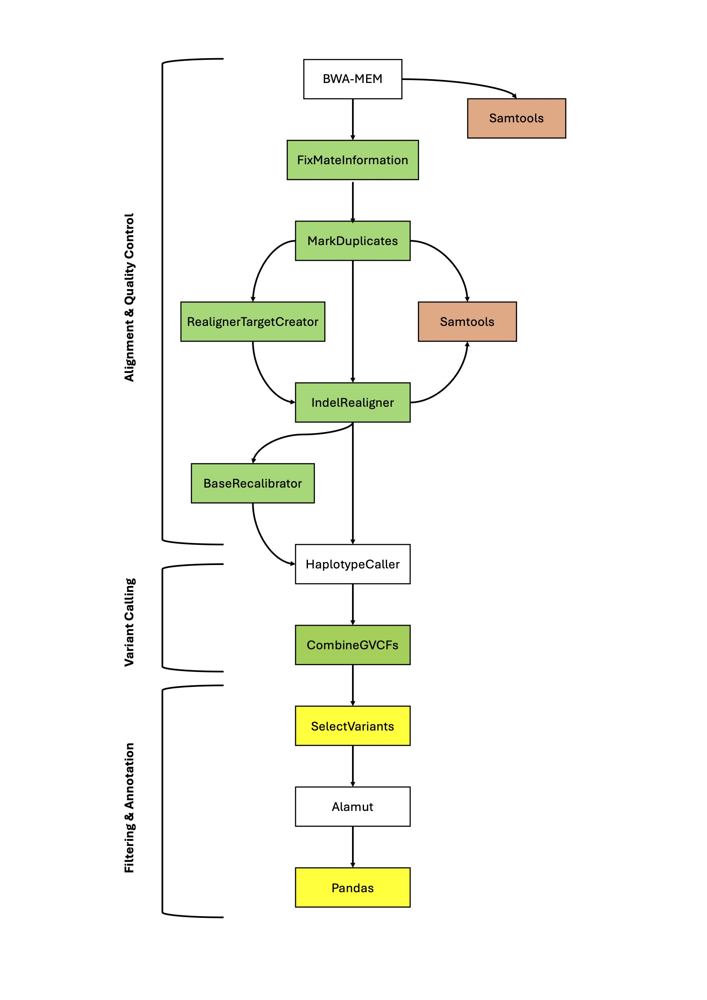

# Whole Genome Sequencing (WGS) Trio Analysis Pipeline

This project involves the analysis of whole genome sequencing (WGS) data for a proband diagnosed with pancreatic agenesis and heart defects, analyzed as part of a trio (proband, mother, father). The automated bioinformatics pipeline, developed in Bash, covers all stages from genome alignment to variant calling and annotation. Through this analysis, a de novo splice site variant in the LZTR1 gene—associated with Noonan Syndrome 10 (NS10)—was identified as the likely cause of the proband’s clinical presentation.

Designed with automation, crash resilience, scalability, and reproducibility in mind, this pipeline ensures efficient processing and accurate variant identification for high-throughput WGS datasets.

---


## Prerequisites

This pipeline requires several bioinformatics tools and reference databases. Ensure all software is installed and accessible in your environment.

### Required Software

1. **BWA** (Burrows-Wheeler Aligner) - [Installation Guide](http://bio-bwa.sourceforge.net/)
   - Version: bwa-mem
2. **Picard Tools** - [Download Link](https://broadinstitute.github.io/picard/)
   - For manipulating high-throughput sequencing data, compatible with GATK 3.6.
3. **GATK (Genome Analysis Toolkit)** - [GATK Download](https://gatk.broadinstitute.org)
   - Version: 3.6.0, for variant calling and quality score recalibration.
4. **Alamut Batch** (optional) - [Alamut Batch Info](https://www.interactive-biosoftware.com/alamut-batch/)
   - A variant annotation tool; requires a license.

### Reference Databases

The following reference files are required for variant calling and filtering:

1. **Human Reference Genome** (e.g., `human_g1k_v37.fasta`)
   - Used for alignment and variant calling.
   - Available from [GATK Resource Bundle](https://gatk.broadinstitute.org/hc/en-us/articles/360035890811-Resource-bundle)
2. **Mills and 1000G Gold Standard Indels** (b37)
   - For indel realignment.
3. **ExAC v1 (or similar) Variant Database**
   - For base recalibration (BQSR).
4. **dbSNP Common Variants Database**
   - Filters out common variants; available in GATK Bundle.
5. **Known Artefacts Database** (e.g., V501 common artefacts)
   - Used to filter known artefacts during variant filtering.

## Environment Setup

Ensure all software and databases are in your system’s PATH and accessible. The pipeline is optimized for high-performance computing environments with Java (Java 8 required for compatibility with GATK 3.6 and Picard).

## Usage

The script processes the sequencing data for each member of the trio by taking in the sample identifiers and paths to their respective FASTQ files.

### Command

```bash
./script.sh CELL_IDENTIFIER PROBAND_ID PROBAND_FASTQ1 PROBAND_FASTQ2 MOTHER_ID MOTHER_FASTQ1 MOTHER_FASTQ2 FATHER_ID FATHER_FASTQ1 FATHER_FASTQ2

